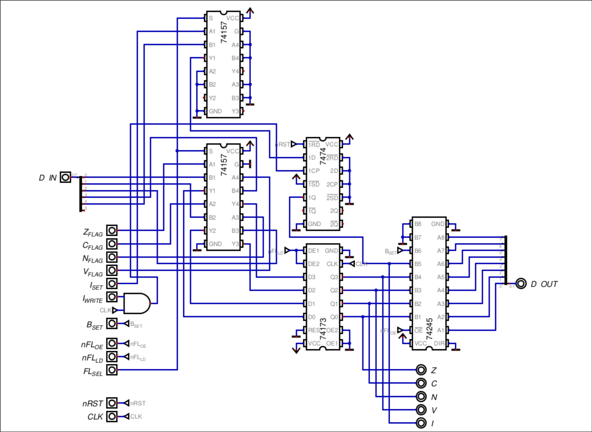

# STATUS REGISTER

## Overview & Memory Layout

The Status Register (SR) is a 5-bit register that stores the four ALU condition flags and the Interrupt flag. The four ALU flags are Zero (Z), Carry (C), Negative (N), and Overflow (V). The fifth bit is the Interrupt flag (I), which controls whether the CPU responds to interrupt requests.

The register is not implemented as a single 5-bit register. It is split into two storage elements:

- A **4-bit register** for the ALU condition flags
    
- A **1-bit D flip-flop** for the Interrupt flag

This division is intentional. The ALU flags and the Interrupt flag do not always update at the same time. Some operations must preserve the condition flags while still allowing the Interrupt flag to change, and vice versa. Separate storage with separate load controls makes this possible without adding extra gating logic to mask individual writes.

The register is not programmer-visible as a general-purpose register. It is used implicitly by the CPU for conditional execution, interrupt handling, and context saving.

The sixth bit (bit 5) is the B flag, which is not stored in the register. It is generated by the Control Unit and injected into the tri-state buffer output, so technically it is not a part of the status register.

## Hardware Architecture & Data Path

The Status Register has two input sources, selected by a pair of 74157 2-to-1 multiplexers:

- **ALU / Control Unit** — supplies the condition flags and the Interrupt flag during normal execution.
    
- **Data Bus** — supplies the saved status value during a pop from the stack (context restore).
    

The MUX select line is shared by both 74157s. Because the register is 5 bits wide, two 74157 packages are required. The first package handles four bits; the second package handles the fifth bit and leaves the remaining three muxes unused.

After the MUX, the data is stored in:

- A **4-bit register** for the ALU flags (Z, C, N, V)
    
- A **1-bit D flip-flop** for the Interrupt flag (I)
    

The register outputs feed directly into the Control Unit, so the flags can be evaluated for conditional branches and interrupt decisions. The same outputs are also connected to a tri-state buffer that drives the data bus. This allows the CPU to push the Status Register onto the stack during an interrupt or a context save.

As seen in the diagram, the sixth input (bit 5) of the 74245 (tri-state buffer) is connected to a control signal called `B_SET`, which as previously mentioned, is toggled by the software.
## Control Signals & Operations

| Signal    | Active Level | Function                                         |
| --------- | ------------ | ------------------------------------------------ |
| `FL_SEL`  | High         | Selects the input between ALU and data bus       |
| `nFL_OE`  | Low          | Outputs the flag register onto the data bus      |
| `nFL_LD`  | Low          | Loads the flags into the registers               |
| `I_SET`   | High         | Bit that shows the I state                       |
| `I_WRITE` | High         | Control bit that writes the state of `I_SET`     |
| `B_SET`   | High         | Differenciates between software and hardware int |
### Operations

| Operation | Main Signals Triggered        |
| --------- | ----------------------------- |
| `PUSHF`   | `nFL_OE`                      |
| `POPF`    | `nFL_LD`, `FL_SEL`, `I_WRITE` |
| `SEI`     | `I_WRITE`, `I_SEL`            |
| `CLI`     | `I_WRITE`                     |
| `BRK`     | `nFL_OE`, `B_SET`, ...        |

## Timing, Latches & Critical Paths

Both storage elements are synchronous. Their outputs change only on the rising clock edge, after the setup time and propagation delay.
